# Projects

Most of my projects are currently private, nevertheless I present some previews of them.

Feel free to contact me if you want to know more. 

## Project Table

| Project | Link |
| ------ | ------ |
| [P-Hug](#P-Hug)| [P-Hug](https://github.com/AlessandroBarbiero/Robotics-and-Design-project)|
| [Missile Simulator](#Missile-Simulator)| Private |
| [Santorini Game](#SantoriniGame)| Private |
| [Improved NEQR Compression](#ImprovedNEQRCompression)| Private |
| [CLup](#CLup) | Private |
| [Working Zone](#WorkingZone) | Private |
| [Visual Question Answering](#VisualQuestionAnswering) | Private |
| [Crop Segmentation](#CropSegmentation) | Private |
| [Face Mask Detector](#FaceMaskDetector) | Private |
| [Robot Odometry](#RobotOdometry) | Private |
| [Robot Localization](#RobotLocalization) | Private |
| [Thumb Led](#ThumbLed)| Private |

## P-HUG 
According to surveys and research the haptic sense is a significant aspect of human wellbeing. The experience received as a result of contact with another living creature like hugs stimulates serotonin production. High serotonin levels improve mood, make people feel better, and help having better sleep. Nowadays people are more linked than ever before as a result of the developing trend of technology. While technology has helped to bridge the gap, it has not been able to eliminate all the barriers imposed by distance. Our initiative primarily aims to bridge this gap by creating a product that sends a haptic hug from one device (Giffy: the puppet) to another one (the Jacket). The embrace and caress from the puppet is transfered via a wifi connection to the wearer of the jacket. The wearer can feel three major sensations: vibration achieved by vibration motors simulating a moving caress, pressure from an inflatable chamber simulating a hug, and a constant warm feeling from a resistive wire. Our goal is not to replace an actual embrace, but to help people that live apart and cannot hold their loved ones having a fraction of that so desired contact.

### Electronics organization
Here are reported the wiring schemas for the two devices
#### `Giffy`
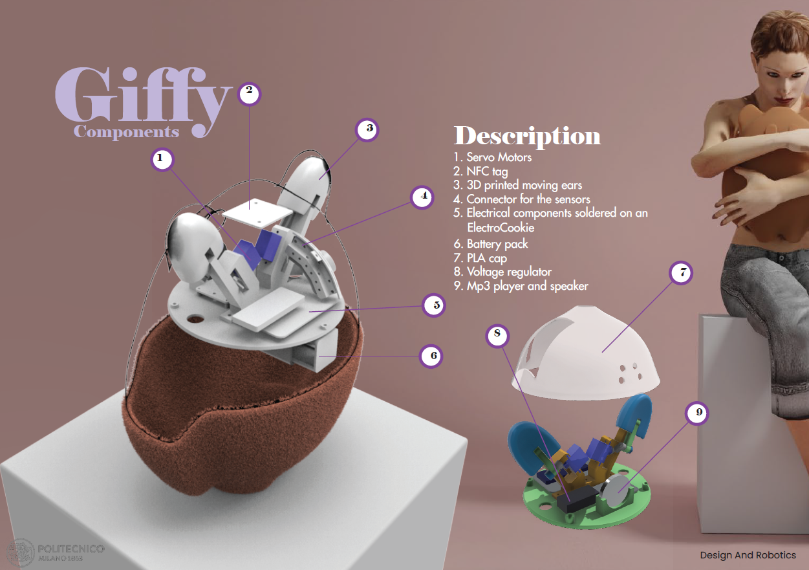
Built around an `Arduino Mkr1000 wifi`

Input:
- 3 Force sensitive resistors to simulate the caress
- Force sensitive resistor to simulate the hug
- Accelerometer to detect shaking
- NFC reader to upload SSID and Password using the Application

Output:
- 2 Servo motors to move the ears
- Speaker
- Integrated Wifi module (ATSAMW25) of Arduino Mkr1000 wifi

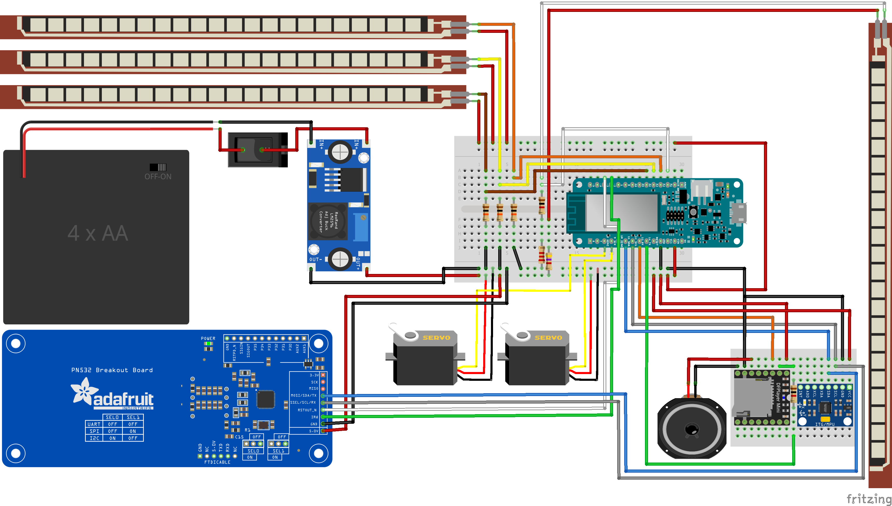

#### `The Jacket`
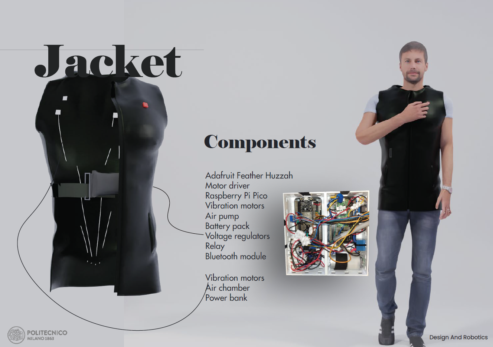
Built around an `Adafruit Feather Huzzah`

Input:
- Integrated Wifi module (ESP8266) of Adafruit Feather Huzzah 
- Bluetooth module (HC-05) to upload SSID and Password

Output:
- 6 Vibration motors to simulate the caress
- Air pump to inflate the chamber around the waist to simulate the hug
- Heating resistance activated via a relè

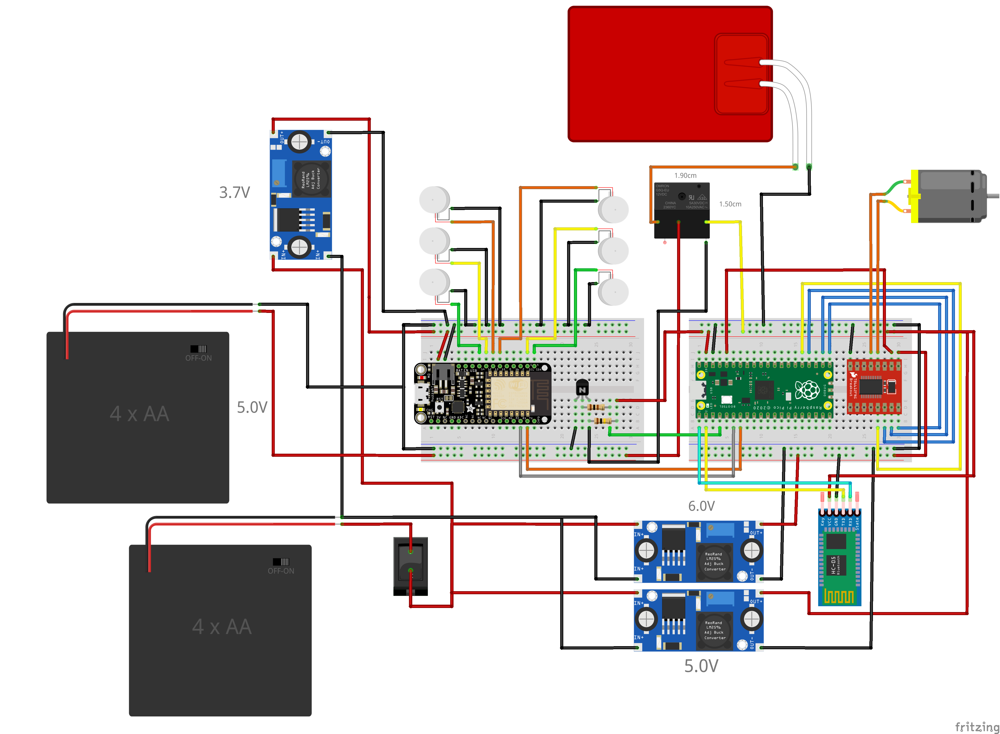

### Code organization
All the code has been written following the object oriented programming model with the help of the platform `PlatformIO`.
The main idea is to build a client-server model to receive the information from Giffy and send it to the jacket that operates according to that.

The code can be seen in the folders [Client](/Client/) for Giffy and [Server](/Server/) for the Jacket.

### Team

  

## Robot Odometry <a name="RobotOdometry">

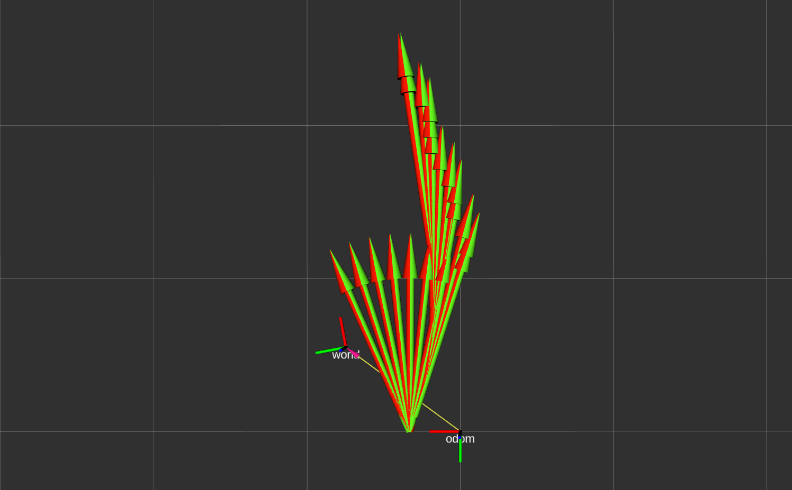

[Scout 2.0](https://www.agilex.ai/index/product/id/2) is an indoor and outdoor mobile platform, dedicated to the development of multiple applications in higher education, research and industry.

In this project we are given some recorded data about the robot: speed of the 4 motors, odometry provided by the manufacturer and the ground truth pose of the robot acquired with [OptiTrack](https://www.optitrack.com/applications/robotics).

Using Robot Operating System (ROS) we have pursued are the following goals:
- compute odometry using skid steering approximated kinematics;
- use dynamic reconfigure to select between integration methods (Euler/Runge-Kutta);
- write 2 services to reset the odometry to (0,0,0) or to a certain pose (x,y,θ)
- publish a custom message with odometry value and type of integration.

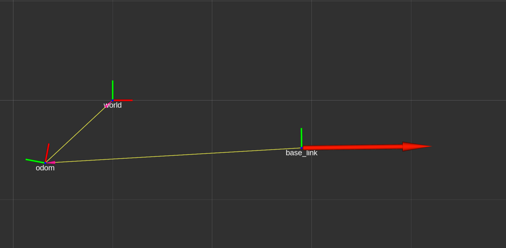

## Robot Localization <a name="RobotLocalization">

[Scout 2.0](https://www.agilex.ai/index/product/id/2) is an indoor and outdoor mobile platform, dedicated to the development of multiple applications in higher education, research and industry.

In this project we are given some recorded data, such as the odometry provided by the manufacturer and other data from the following robot sensors:
- *OptiTrack* tracking system, which publishes the pose of the robot in the `/Robot_1/pose` topic;
- *SICK LMS100* lidar, which publishes the laser data in the `/scan` topic;
- *Intel T265* camera, which publishes the visual odometry in the `/camera/odom/sample` topic and the IMU data in the `/camera/accel/sample` and `/camera/gyro/sample` topics;
- *Pixhawk mini* IMU, which publishes the IMU data in the `/mavros/imu/data_raw`.

Using Robot Operating System (ROS) we have pursued are the following goals:
- create of a map from the recorded data above;
- fuse different data sources using *robot_localization* package;
- localize the robot using *amcl* package and *robot_localization* package.

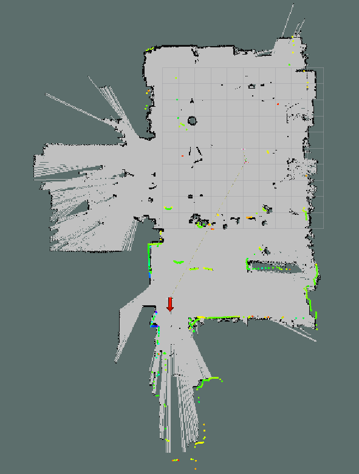

## Face Mask Detector <a name="FaceMaskDetector">
The task of the project was to solve a classification problem using convolutional neural networks. In particular, the task was to distinguish, given an
image, three cases:
- No person in the image is wearing a mask
- Everyone is wearing a mask
- Someone in the image is not wearing a mask

## Crop Segmentation <a name="CropSegmentation">
The task of the project was to solve a segmentation problem. In particular, given a RGB image, the task was to
create a segmentation mask to distinguish between crop, weeds, and background.

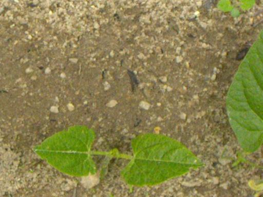    

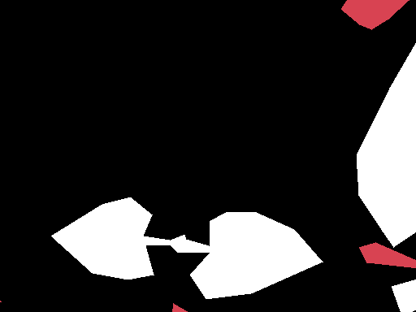 
    
## Visual Question Answering <a name="VisualQuestionAnswering">
The task of the project was to solve a visual question answering (VQA) problem. Given an image and a question,
the goal was to provide the correct answer.

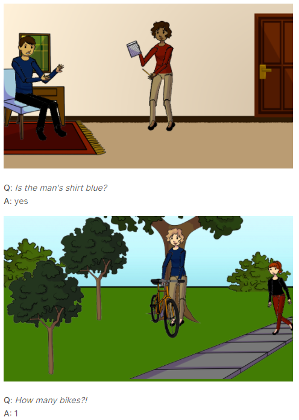 

## Santorini Game <a name="SantoriniGame">

Enjoy a unique gaming experience with the digital version of the tabletop game Santorini 

    
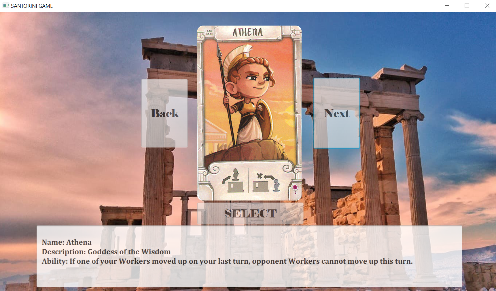
    
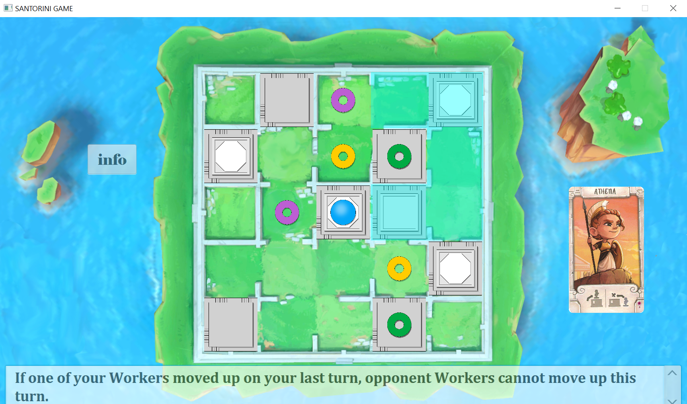

## Improved NEQR Compression <a name="ImprovedNEQRCompression">
Writing a paper on images compression in Quantum Computers and relative implementation.

    Abstract

*This paper presents the implementation of NEQR and its compression. The aim of the paper is to highlight the practical limits of the
compression theorized so far and to propose an improvement which can be implemented grouping CNOT gates that have the same control information. At the end of the report we present some results we obtain highlighting the improvement achieved in the compression phase.*

## CLUP <a name="CLup">

Design Document (DD) and Requirement Analysis and Specification Document (RASD) of an application (CLup) which help store managers to regulate the
influx of people in the building monitoring entrances to comply with the coronavirus safety regulations.
Moreover the application has the goal to prevent people from waiting outside the store safeguarding clients health and not wasting their time.

## Working Zone <a name="WorkingZone">
The project is based on the low power dissipation coding method called "Working Zone".
Through this type of coding it is possible to transform an address according to the belonging to certain intervals (Working Zones).
The module is implemented using VHDL. The module reads the address to be encoded and the base addresses of the Working Zones and it outputs the encoded address.

A Working Zone is characterized by :
- Base address (first address that identifies the Working Zone, from 00000000 to 11111100)
- Size (fixed of 4 addresses including the base address)
- Number of bits per address (8 bits)

Each Working Zone base address is contained within a memory address (from 0 to 7) and therefore the number of Working Zones is 8. The address to be transmitted can vary from 0 to 127 (000000-011111111) and it is contained within address 8 of the memory. The encoded address, instead, is written inside
address 9 of the memory.
- If the address to be transmitted is not contained in any Working Zone, it is transmitted without change.
- If the address to be transmitted is contained in a Working Zone :
    - The first bit is set to 1
    - From the second bit to the fourth bit, the number of the Working Zone is encoded in binary.
        - 000 (WZ 0)
        - 001 (WZ 1)
        - 010 (WZ 2)
        - 011 (WZ 3)
        - 100 (WZ 4)
        - 101 (WZ 5)
        - 110 (WZ 6)
        - 111 (WZ 7)
    - In the remaining bits there is the one-hot encoding of the offset
        - 0001 (offset = 0)
        - 0010 (offset = 1)
        - 0100 (offset = 2)
        - 1000 (offset = 3)

    ## Thumb Led

https://user-images.githubusercontent.com/47597693/158889676-5202d286-a42f-43c0-abf5-110485148884.mp4

### <a name="ThumbLed">

One week project in which I implemented a Convolutional Neural Network model which was able to distinguish three different classes
- Thumb UP
- Thumb DOWN
- No thumb

The predicted class is then sent via Bluetooth to the Raspberry Pi. 
An application, running on the Raspberry, processes the data received and based on what receives turns on a specific led.

